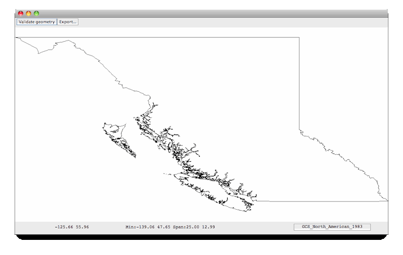
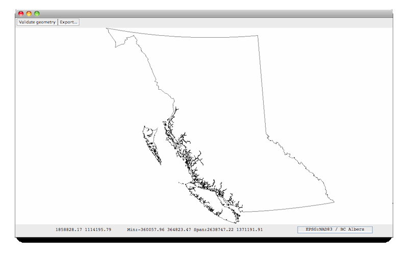

.. _crslab:

CRS Lab
=======

This tutorial gives a visual demonstration of coordinate reference systems by displaying
a shapefile and showing how changing the map projection morphs the shape of the features.

Dependencies
------------
 
Please ensure your pom.xml includes the following::

  <properties>
      <geotools.version>2.6.1</geotools.version>
  </properties>

  <dependencies>
      <dependency>
          <groupId>org.geotools</groupId>
          <artifactId>gt-shapefile</artifactId>
          <version>${geotools.version}</version>
      </dependency>
      <dependency>
          <groupId>org.geotools</groupId>
          <artifactId>gt-epsg-hsql</artifactId>
          <version>${geotools.version}</version>
      </dependency>
      <dependency>
          <groupId>org.geotools</groupId>
          <artifactId>gt-swing</artifactId>
          <version>${geotools.version}</version>
      </dependency>
  </dependencies>

Example
-------

The example code is available
 * Directly from svn: CRSLab.java_
 * Included in the demo directory when you download the GeoTools source code

.. _CRSLab.java: http://svn.osgeo.org/geotools/trunk/demo/example/src/main/java/org/geotools/demo/CRSLab.java 
 
Main Application
----------------
1. Please create the file **CRSLab.java**
2. Copy and paste in the following code:

   .. literalinclude:: ../../../../../demo/example/src/main/java/org/geotools/demo/CRSLab.java
      :language: java
      :start-after: // docs start source
      :end-before: // docs end main

Displaying the shapefile
------------------------

This method opens and connects to a shapefile and uses a **JMapFrame** to display it. It should look familiar to you from 
the :ref:`quickstart` example.

   .. literalinclude:: ../../../../../demo/example/src/main/java/org/geotools/demo/CRSLab.java
      :language: java
      :start-after: // docs start display
      :end-before: // docs end display

Notice that we are customizing the JMapFrame by adding two buttons to its toolbar.

Button actions
--------------

In the method above we initialized each of the toolbar buttons with an Action. Let's look at each of these now.

Change CRS Action
~~~~~~~~~~~~~~~~~

The first two statements set the name (displayed on the button) and the tooltip.

The important bit is where we display a JCRSChooser dialog to prompt the user for a new CRS which we pass to the MapContext. This has
the effect of refreshing the map display.

   .. literalinclude:: ../../../../../demo/example/src/main/java/org/geotools/demo/CRSLab.java
      :language: java
      :start-after: // docs start crs action
      :end-before: // docs end crs action

Export Action
~~~~~~~~~~~~~

This simply delegates to the exportToShapefile method which we'll look at shortly.

   .. literalinclude:: ../../../../../demo/example/src/main/java/org/geotools/demo/CRSLab.java
      :language: java
      :start-after: // docs start export action
      :end-before: // docs end export action

Validate Action
~~~~~~~~~~~~~~~

This action also delegates to a helper method, validateFeatureGeometry, but it uses the SwingWorker
utility class to run the validation process in a background thread in case we are dealing with a large
shapefile.

   .. literalinclude:: ../../../../../demo/example/src/main/java/org/geotools/demo/CRSLab.java
      :language: java
      :start-after: // docs start validate action
      :end-before: // docs end validate action

Exporting reprojected data to a shapefile
-----------------------------------------

   .. literalinclude:: ../../../../../demo/example/src/main/java/org/geotools/demo/CRSLab.java
      :language: java
      :start-after: // docs start export
      :end-before: // docs end export

Validating feature geometry
---------------------------

   .. literalinclude:: ../../../../../demo/example/src/main/java/org/geotools/demo/CRSLab.java
      :language: java
      :start-after: // docs start validate
      :end-before: // docs end validate

Running the application
-----------------------

Swapping between map projections
~~~~~~~~~~~~~~~~~~~~~~~~~~~~~~~~

When you start the application you will be prompted for a shapefile to display. In the screenshots below we are 
using the **bc_border** map which can be downloaded as part of the `uDig sample data`__.

.. _udigdata: http://udig.refractions.net/docs/data-v1_2.zip

__ udigdata_

Click the CRS button at the right-hand end of the status bar and choose *Set the CRS...* from the pop-up menu to
display this chooser dialog:

.. image:: CRSLab_chooser.gif

GeoTools includes a very extensive database of map projections drawn from the EPSG reference (see `Some useful links`_ below).
For our example shapefile, an appropriate alternative map projection is *BC Albers* (tip: you can find this quickly in the
chooser list by typing 3005).

When you click OK the map is displayed in the new projection:

Note that when you move the mouse over the map the coordinates are now displayed in metres (the unit of measurement that
applies to the *BC Albers* projection) rather than degrees.

To return to the original projection, open the CRS chooser again and type **4326** for the default geographic projection.
Notice that the map coordinates are now expressed in degrees once again.

Exporting the reprojected data
~~~~~~~~~~~~~~~~~~~~~~~~~~~~~~

*To be continued...*

An alternative export to shapefile method
~~~~~~~~~~~~~~~~~~~~~~~~~~~~~~~~~~~~~~~~~

   .. literalinclude:: ../../../../../demo/example/src/main/java/org/geotools/demo/CRSLab.java
      :language: java
      :start-after: // docs start export2
      :end-before: // docs end export2

Some useful links
-----------------

`EPSG registry <http://www.epsg-registry.org/>`_ 
  This is *the* place to go to look up map projections. You can search by geographic area, name and type (and, of course, by EPSG code !).

`Online coordinate conversion tool <http://gist.fsv.cvut.cz:8080/webref/>`_
  Produced by Jan Jezek and powered by GeoTools.

`Wikibook: Coordinate Reference Systems and Positioning <http://en.wikibooks.org/wiki/Coordinate_Reference_Systems_and_Positioning>`_
  A summary page with some useful definition and links to more detailed information

